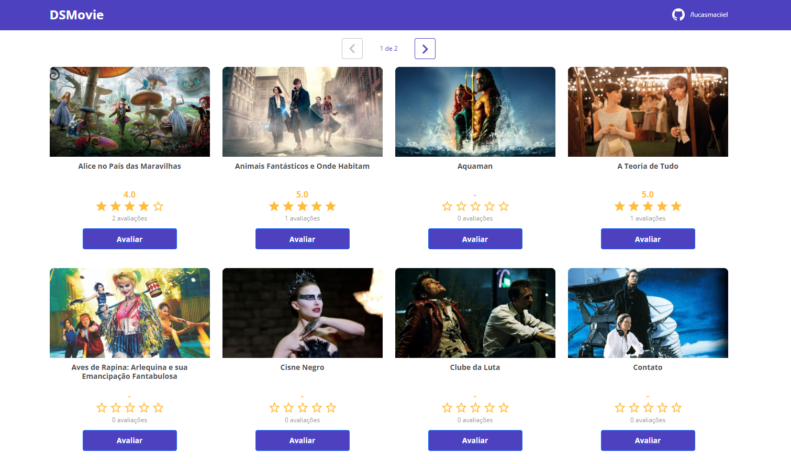
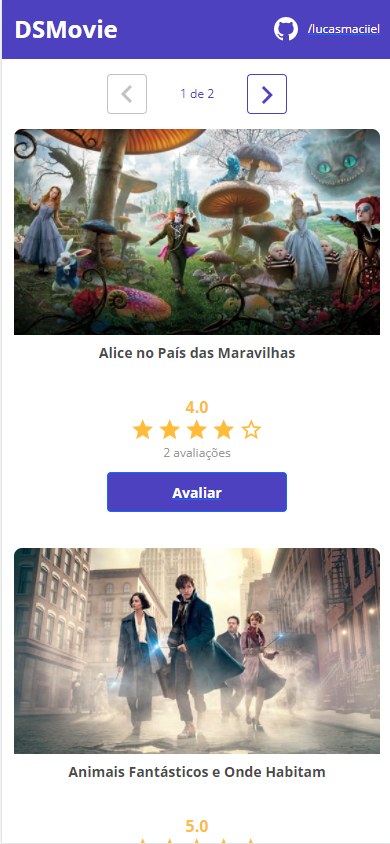

#  Semana Spring React 15/01/22

## Projeto DSMovie

## Tecnologias
O sistema utiliza React em seu front-end e Spring no back-end.

## Funcionalidades
- Tela Home (início): Tela inicial, onde mostra a lista de filmes cadastradas com páginas de navegação.
- Tela de Cadastro: Tela de Score dos filmes, aonde pode atribuir uma nota a um filme, e o sistema recalcula a média dos scores

## Desktop

## Mobile

